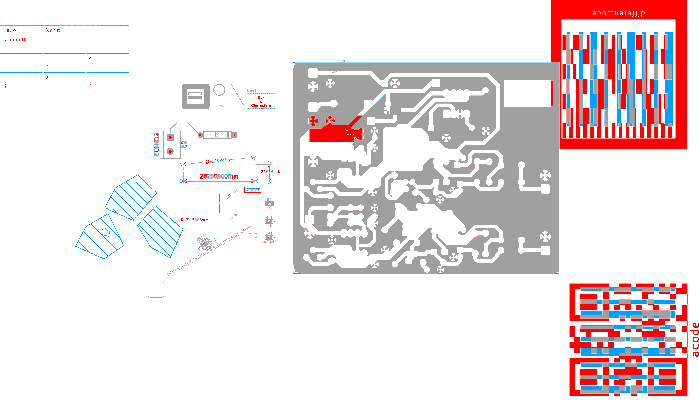
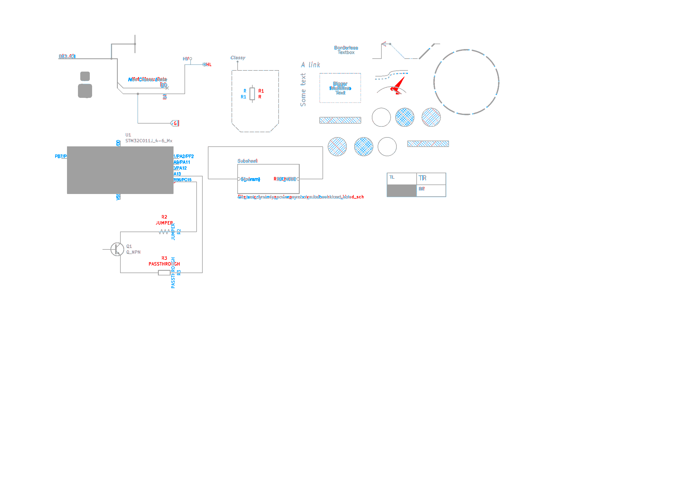

# @kicad-web/renderer

PixiJS v8 canvas renderer for kicad-web. Implements the `CanvasHost` contract from
[docs/contracts.md](../../docs/contracts.md) over an `ItemStore`-shaped object, with a
neutral render model (`RenderItem` / `Primitive`) so the core never depends on
`@kicad-web/proto`. Wave-2 agent A5 owns `core/` and `board/`; A6 adds `schematic/` on top.

```
src/
  core/
    model.ts      Vec2 / Box helpers, Primitive + RenderItem (contracts.md "Render model")
    geometry.ts   arcs (start/mid/end), pad shape generators, dashes, hatching, distance tests
    theme.ts      Theme type, KiCad colour JSON loader, built-in themes, layer -> colour
    camera.ts     float64 camera (nm -> px), moving origin, wheel/trackpad/pinch/touch/keys
    scene.ts      Pixi Container per layer, per-item objects, diff apply, primitive builders,
                  GraphicsContext instancing, earcut meshes for zone fills
    picker.ts     flatbush index + exact per-primitive tests, nearest-first
    overlays.ts   grid (mm/mil, adaptive), origin/axes, selection, hover, rubber band
    ratsnest.ts   airlines from GetRatsnest as hairlines, emphasis by net highlight / selection
    markers.ts    DRC / ERC marker glyphs (MARKER_BASE arrow), zoom-scaled, picked, legend
    host.ts       BaseCanvasHost (CanvasHost contract, pointer events, resize, render loop)
  board/
    boardLayers.ts   BoardLayer enum table, copper/tech classification, pcbnew draw order
    boardAdapter.ts  kiapi board messages -> RenderItems (every KOT_PCB_* type)
    BoardCanvasHost.ts
  schematic/
    schematicLayers.ts   theme-key layer ids (`schematic.wire`, ...), eeschema draw order, default sizes
    symbolTransform.ts   SCH_SYMBOL TRANSFORM (orientation + mirror), pin draw orientation, text through it
    labelShapes.ts       global / hierarchical / directive label and sheet-pin outlines (sch_label.cpp)
    textMetrics.ts       font-free text box estimates (EDA_TEXT::GetTextBox / GetLinePositions)
    textGlyphs.ts        Pixi BitmapText builder for the `text-glyphs` fallback primitive
    schematicAdapter.ts  kiapi schematic messages -> RenderItems (every KOT_SCH_* type)
    SchematicCanvasHost.ts
themes/
  kicad-default.json, kicad-classic.json   generated from the KiCad sources (see below)
scripts/gen-themes.ts
scripts/pixel-diff.ts + pixel-diff/page.ts   pixel diff against KiCad's own SVG export
demo/            synthetic board for eyeballing pan/zoom/pick
test/            bun tests (theme, camera, picker/geometry, adapter, overlays, headless scene)
```

## Usage

```ts
import { BoardCanvasHost, KICAD_DEFAULT_THEME, loadUserTheme, copperLayerList } from '@kicad-web/renderer';

const host = new BoardCanvasHost(KICAD_DEFAULT_THEME, {
  copperLayers: copperLayerList(4),          // from GetBoardEnabledLayers / stackup
  adapter: {
    padPolygons: (padId, layer) => padPolyCache.get(`${padId}/${layer}`),   // GetPadShapeAsPolygon
    textShapes: (textId) => textShapeCache.get(textId),                    // GetTextAsShapes
  },
});
host.mount(div, board.store, KICAD_DEFAULT_THEME);   // store: ItemStore from @kicad-web/client
await host.ready;                                    // WebGL context up, first frame drawn

host.onPick((hits, ev) => select(hits[0]?.owner));   // hits nearest-first, distance in px
host.onHover((hit) => showTooltip(hit?.ref));
host.onBoxSelect(({ hits, touching }) => select(hits.map((h) => h.owner)));
host.setSelection(['<kiid>']);                       // KIIDs or render-item ids
host.setHighlightNets(['GND']);
host.setActiveLayer('BL_B_Cu');                      // draw order like pcbnew
host.flipView(true);                                 // view from the back
host.setTheme(loadUserTheme(await file.text()));     // ~/.config/kicad/10.0/colors/user.json
host.setAdapterContext({ padPolygons: ... });         // rebuilds everything once server shapes arrive

host.setRatsnest(edges);                             // GetRatsnest airlines (see below)
host.setMarkers(markers);                            // DRC violations
host.focusMarker(markerId);                          // animate the camera to it + show the legend
host.setLabelOptions({ padNumbers: true, netNames: true });   // board only, zoom-gated
```

`setLayerVisible` / `setLayerOpacity` take render-model layer ids: `BL_*` BoardLayer enum names or
theme keys for pseudo layers (`board.via_hole`, `board.pad_plated_hole`, `board.plated_hole`
(NPTH), `board.anchor`, `board.points`, `board.grid_items`, `board.aux_items`).

Extra (beyond the contract): `onBoxSelect`, `pickBox(box, touching)`, `flipView`, `isFlipped`,
`contentBox()`, `rebuildAll()`, `rebuildItems(ids)`, `getRenderItem(id)`, `requestRender()`,
`renderNow()`, `overlays.options` (grid unit/style/visibility), `camera`, `scene`, `picker`,
plus the overlay APIs below (`setRatsnest`, `setMarkers`, `focusMarker`, `setLabelOptions`).

### PickResult

```ts
{ id, distance, owner, ref, layer, net? }
```
- `id` — render item id, unique per (object, layer): `"<kiid>"` for single-layer items,
  `"<kiid>@BL_F_Cu"` for pads / vias / zones per layer, `"<kiid>@hole"` for drill decorations.
- `ref` — the object KIID without suffix (pad, via, zone, track KIID). Use this for the UI.
- `owner` — the store item that produced it: the footprint KIID for pads / fp shapes / fields,
  otherwise equal to `ref`.
- `distance` — screen px from the pointer (0 = inside).

Footprints themselves are pickable through their bbox (a body item with no geometry), sorted
after their children, so clicking a pad yields `[pad, footprint]`.

## What the board adapter expects

`BoardCanvasHost.toRenderItems(item)` calls `boardItemToRenderItems(item, ctx)` with the
`StoredItem` from the contract: `{ id, type, layer?, net?, parent?, proto }`. `type` is the
`KOT_*` name (`KOT_PCB_TRACE`, `KOT_PCB_FOOTPRINT`, ...); if empty it is derived from
`proto.$typeName`. `proto` is the **protobuf-es message object** for the item:

- field names in camelCase as in the proto (`padStack`, `filledPolygons`, `referenceField`);
- `Vector2` = `{ xNm, yNm }`, `Distance` = `{ valueNm }`, `Angle` = `{ valueDegrees }`,
  `KIID` = `{ value }`, `Net` = `{ code: { value }, name }`; int64 fields may be
  `bigint | number | string` (normalised with `Number()`);
- enums are numbers (protobuf-es) — enum names as strings are accepted too;
- oneofs in protobuf-es form `{ case: 'segment', value: {...} }` (flat `{ segment: {...} }` is
  also accepted);
- `PolySet` = `{ polygons: [{ outline: { nodes: [{ geometry: { case: 'point'|'arc', value } }] }, holes: [...] }] }`;
- `FootprintInstance.definition.items` must be **decoded**: either the message objects with
  `$typeName` (`kiapi.board.types.Pad`, `...BoardGraphicShape`, `...BoardText`, `...Zone`,
  `...ReferencePoint`) or wrappers `{ type: 'KOT_PCB_PAD', proto }`. Undecoded `Any`s are
  skipped. Children are in absolute board coordinates (KiCad API semantics: `PAD::Serialize`
  uses `GetPosition()`); set `adapter.footprintChildrenAbsolute = false` for library
  footprints whose children are relative to the anchor (then rotation / back-side flip is applied).
- If the store *also* lists pads/shapes/fields as separate items with `parent` set, they are
  skipped when the parent footprint carries `definition.items` (no double drawing).

`BoardAdapterContext`:

| field | purpose |
|---|---|
| `copperLayers` | board copper layers front→back (`copperLayerList(n)`); vias without a layer list span their drill range or all copper |
| `padPolygons(padId, layer)` | `PolygonWithHoles[]` from `GetPadShapeAsPolygon` (or plain `Vec2[][]`); fallback draws circle/rect/oval/trapezoid/roundrect/chamfered/custom padstacks |
| `textShapes(textId)` | `GraphicShape[]` (`CompoundShape.shapes` from `GetTextAsShapes`) or plain glyph polygons; ids: text KIID, textbox KIID, `Field.text.id`, dimension KIID; fallback draws a metrics-estimated box |
| `itemBBox(id)` | bbox lookup for group outlines |
| `imagePixelNm` | reference image pixel pitch (default 25.4e6 / 300 ppi) |
| `arcTolerance` | polygon arc approximation, nm |

Covered types: Track, Arc, Via (ring per copper layer + drill), Pad (copper/mask/paste layers,
PTH/NPTH holes), BoardGraphicShape (segment, rect + corner radius, arc, circle, polygon with
holes and arcs, bezier, ellipse, ellipse arc, line styles dash/dot/dashdot, line endings),
BoardText / BoardTextBox / Field, Zone (filled polygons per layer as meshes, outline, hatched
rule areas), FootprintInstance (children, fields, anchor, body), Dimension (aligned,
orthogonal, radial, leader, center), ReferenceImage (PNG/JPEG/GIF header → size, sprite),
Group (bbox), Barcode, ReferencePoint, GridItem (cartesian/polar), Table. Markers,
generators, constraints and 3D models produce nothing.

## Schematic host

```ts
import { SchematicCanvasHost, KICAD_DEFAULT_THEME } from '@kicad-web/renderer';

const host = new SchematicCanvasHost(KICAD_DEFAULT_THEME, {
  adapter: { textShapes: (id) => textShapeCache.get(id) },   // GetTextAsShapes, keyed as below
  textGlyphs: { fontFamily: 'Helvetica, Arial, sans-serif' },  // BitmapText fallback (false = draw no fallback text)
});
host.mount(div, schematic.sheet(rootPath).store, KICAD_DEFAULT_THEME);
host.setStore(schematic.sheet(childPath).store);   // switch sheets; the camera is remembered per store
host.onPick((hits) => {
  const pin = hits.find(SchematicCanvasHost.isPinHit);   // pin.ref === '<symbol kiid>:<pin number>'
  select(hits[0]?.owner);                                // symbol / sheet / label / wire KIID
});
```

Layers are KiCad theme keys (`SCH_LAYERS`: `schematic.wire`, `schematic.bus`, `schematic.junction`,
`schematic.label_local` / `label_global` / `label_hier`, `schematic.netclass_flag`, `schematic.pin`,
`schematic.pin_number` / `pin_name`, `schematic.reference` / `value` / `fields`,
`schematic.component_outline` / `component_body`, `schematic.note` / `note_background` /
`private_note`, `schematic.sheet` / `sheet_background` / `sheet_name` / `sheet_filename` /
`sheet_fields` / `sheet_label`, `schematic.no_connect`, `schematic.rule_area`, `schematic.dnp_marker`,
`schematic.hidden`, ... plus `schematic.bitmaps` for images), drawn bottom-up in
`SCHEMATIC_DRAW_ORDER` (the reverse of eeschema's `SCH_LAYER_ORDER`). `setActiveLayer` is a no-op.
Items with their own colour (wires, shapes, text with a `color`) carry it as `RenderItem.color`;
`theme.overrideSchItemColors` makes the layer colour win, as in eeschema. Hierarchical-label and
sheet-pin flags are filled with `schematic.background` through a theme-key reference so theme
switches never rebuild geometry.

### Render item ids (schematic)

| item | id | ref | owner |
|---|---|---|---|
| wire / bus / junction / no-connect / bus entry / text / shape / label | `<kiid>` | `<kiid>` | `<kiid>` |
| label / sheet field | `<kiid>:field:<name>` | `<kiid>` | `<kiid>` |
| text box / sheet parts | `<kiid>@bg`, `<kiid>@border`, `<kiid>` | `<kiid>` | `<kiid>` |
| hier label / sheet pin fill | `<id>@fill` (not pickable, `schematic.background`) | | |
| sheet pin | `<sheet>:pin:<pin kiid>` | `<pin kiid>` | `<sheet>` |
| symbol body shape / text | `<sym>:shape:<kiid>`, `<sym>:text:<kiid>` (not pickable) | `<sym>` | `<sym>` |
| symbol pin | `<sym>@pin:<pin kiid>` | `<sym>:<pin number>` | `<sym>` |
| pin number / name | `<sym>@pin:<pin kiid>:number` / `:name` (not pickable) | `<sym>:<pin number>` | `<sym>` |
| symbol field | `<sym>:field:<name>` | `<sym>` | `<sym>` |
| DNP cross | `<sym>@dnp` (not pickable) | `<sym>` | `<sym>` |
| symbol / sheet body | `<kiid>` (bbox only, sorted after its children) | `<kiid>` | `<kiid>` |

Clicking a pin yields `[pin, symbol body]`; `pickPin(x, y)` returns the nearest pin hit only.

### What the schematic adapter expects

`schematicItemToRenderItems(item, ctx)` takes the contract `StoredItem` (`type` = `KOT_SCH_*`
name, derived from `proto.$typeName` when empty) with the protobuf-es message as `proto`,
same conventions as the board adapter (camelCase, `{ xNm, yNm }`, `{ valueNm }`,
`{ valueDegrees }`, numeric enums or their names, `{ case, value }` oneofs, int64 as
`bigint | number | string`). `SchematicSymbolInstance.definition.items[]` are `{ item, unit,
bodyStyle, isPrivate }`; `item` may be a decoded message (`$typeName`), a `{ type: 'KOT_SCH_PIN',
proto }` wrapper, or a `google.protobuf.Any` when `decodeAny` is supplied. Children are filtered
to the instance's `unit` / `bodyStyle` (0 = all) and pushed through `SCH_SYMBOL::GetTransform`
(`transform.orientation` SSO_0..270 + `mirrorX` / `mirrorY`, applied in that order) about
`position`. Pin positions are absolute sheet coordinates by default (API semantics:
`SCH_PIN::Serialize` uses `GetPosition()`); set `symbolPinsAbsolute: false` for library-relative
pins. Instance fields (`referenceField`, `valueField`, ..., `userFields`) are in absolute sheet
coordinates and are rotated through the transform the way eeschema keeps them readable
(mirrors and 180° become justification flips). If the store also lists `KOT_SCH_PIN` /
`KOT_SCH_FIELD` / `KOT_SCH_SHEET_PIN` items with `parent` set, the host skips them when the
parent is in the store.

`SchematicAdapterContext`:

| field | purpose |
|---|---|
| `textShapes(textId)` | `GraphicShape[]` (`CompoundShape.shapes` from `GetTextAsShapes`) or plain glyph polygons, in sheet coordinates. Keys: the item KIID for text / labels / text boxes; `<sym>:field:<name>`, `<sym>:pin:<pin kiid>:name` / `:number`, `<sym>:text:<kiid>` for symbols; `<sheet>:field:<name>`, `<sheet>:pin:<pin kiid>` for sheets; `<label>:field:<name>` for label fields |
| `decodeAny(any)` | decoder for `Any` symbol children (`unpackAny` from @kicad-web/proto) |
| `itemBBox(id)` | bbox lookup for group outlines |
| `symbolPinsAbsolute` | default true; false = pins in library coordinates |
| `showHiddenPins` / `showHiddenFields` | draw hidden pins / fields on `schematic.hidden` |
| `showDnpMarkers` | DNP cross (default true) |
| `textFallback` | `'glyphs'` (default: `text-glyphs` primitives for the BitmapText builder), `'box'` (metrics outline), `'none'` |
| `imagePixelNm`, `arcTolerance` | as for the board adapter |
| `defaults` | overrides for line / wire / bus widths, junction diameter, text sizes, offset ratios (`eeschema/default_values.h`) |

Text: with `textShapes` the server glyphs are drawn verbatim (exact output). Without them the
adapter emits `text-glyphs` primitives sized by a stroke-font estimate (`textMetrics.ts`:
0.8 × size.x per character, KiCad interline); the schematic host's `primitiveBuilder`
(`textGlyphs.ts`) draws them as Pixi `BitmapText` stretched to that box, so picking and
drawing agree. The core stays font-free: `text-glyphs` only contribute their outline to
bbox / picking there. Pixi text is used nowhere else.

Covered types: SchematicLine (wire / bus / graphic with line styles and endings), Junction,
NoConnectMarker, BusEntry (wire / bus), SchematicText, SchematicTextBox (margins, border,
fill), SchematicGraphicShape (all geometries; fills: filled, colour, background-body, hatch /
reverse / cross hatch), SchematicImage, LocalLabel, GlobalLabel (input / output / bidi /
tristate / passive flags per `SCH_GLOBALLABEL::CreateGraphicShape`), HierarchicalLabel
(template shapes), DirectiveLabel (circle / dot / diamond / rectangle + fields), Group (bbox),
SchematicRuleArea, SheetSymbol (background, border, name / file / user fields, SheetPins with
input ↔ output swapped shapes, DNP), SchematicSymbolInstance (shapes, text, text boxes, pins
with number / name text placement per `PIN_LAYOUT_CACHE` and electrical-type / shape
decorations, instance fields, DNP cross from `SCH_PAINTER::draw(SCH_SYMBOL)`), standalone
SchematicPin / SchematicField / SheetPin, SchematicTable. Markers produce nothing.

## Themes

`themes/kicad-default.json` and `themes/kicad-classic.json` are generated by
`bun run gen:themes [path-to-kicad-src]` from `common/settings/builtin_color_themes.h`
(`s_defaultTheme` / `s_classicTheme`), `common/settings/color_settings.cpp` (the
`CLR("board.copper.f", F_Cu)` key table, gerbview layer loop, 3D-viewer user layers) and
`common/gal/color4d.cpp` (the legacy named palette, which is stored B,G,R). The JSON layout
is KiCad's own, so `themeFromJson` / `loadUserTheme` read user theme files unchanged. Only the
two built-in themes exist in the KiCad tree (no Eagle / Behave Dark there). The macOS-specific
`#ifdef __WXMAC__` selection-shadow colour is not used; the generic value is.

Layer colours: `layerColor(theme, 'BL_In3_Cu')` → `board.copper.in3` with KiCad's looping
fallbacks for copper / user layers, missing keys falling back to the default theme.

## Rendering notes

- Geometry is drawn white and tinted per item from the layer colour, so theme changes and net
  highlighting (dimming) never rebuild geometry.
- Each RenderItem is one Pixi container positioned at `anchor - origin`, geometry relative to
  its anchor; the camera re-bases the origin when it drifts > 50k px away (`Camera.maybeRebase`),
  so float32 error stays below 0.01 px at any zoom on any board size.
- Items with a `cacheKey` (pads by padstack hash + layer + angle, text by content) share one
  `GraphicsContext`; identical pads are instanced.
- Polygons with ≥ 200 vertices or `mesh: true` (zone fills) become pre-triangulated `Mesh`es.
- Width 0 means hairline (`pixelLine`), round caps/joins elsewhere.
- Wide strokes, arcs and circles are tessellated in `geometry.ts` (`stadiumPolygon`,
  `offsetPathPolygon`, `circleSegments`: ~60 µm per segment, 8..64 per circle) and handed to
  Pixi as polygon fills. Never use Pixi's own `stroke({ width })` / `circle()` / `arc()` with
  nm coordinates: its adaptive tessellation sizes round caps by the radius in local units and
  a 0.15 mm cap becomes tens of thousands of vertices (measured: 190 KB and 2.5 s of first
  frame per 19k items before the change, 6.8 KB and 61 ms after).
- The scene root is a Pixi render group, so pan/zoom is a GPU uniform and the batched child
  geometry is not re-transformed on the CPU each frame.

Measured in the demo (`?n=`, embedded Chromium, M-series Mac): n=5000 → 18.8k render items,
128 MB heap, first frame 61 ms, pan frame 1.5 ms; n=20000 → 75k items, 437 MB, 60 fps,
pan 1.4 ms; n=50000 → 187k items (≈ 400k primitives), 1.06 GB, 61 fps, pan 2.3 ms.
Conversion (adapter + Graphics contexts) runs at ≈ 90k render items/s.
- Draw order follows `pcbnew/pcb_draw_panel_gal.cpp` `GAL_LAYER_ORDER` + `SetTopLayer`.
- Rendering is on demand (`requestRender`), no ticker when idle; `prefers-reduced-motion`
  disables inertial panning.

Input: wheel = zoom (ctrl/⌘+wheel = pinch zoom, horizontal/shift wheel = pan), middle-drag or
touch = pan, two-finger pinch, arrows / +/- keys, left-drag = rubber band (`leftDrag: 'pan'`
to pan instead), click = pick.

## Overlays: ratsnest, DRC/ERC markers, labels

All three live above the scene in world space, so pan / zoom stays a GPU uniform and a theme
switch never rebuilds geometry.

### Ratsnest (`core/ratsnest.ts`, board + schematic host)

```ts
host.setRatsnest(edges);                 // RatsnestEdge[]: { net, a, b, source?, target? }
host.setRatsnestVisible(false);          // or setLayerVisible('board.ratsnest', false)
```

One hairline per edge in the theme's `board.ratsnest` colour. `a` / `b` are
`GetRatsnest`'s `source_position` / `target_position` in nm; `source` / `target` are the KIIDs
at each end. Emphasis follows pcbnew: while a net highlight (`setHighlightNets`) or a
selection is active, edges of the highlighted nets and edges touching a selected item draw at
full alpha and the rest is dimmed to `dimAlpha` (0.2, same as the scene); with neither, every
edge uses the theme colour's own alpha. The overlay is not part of the pick index.

### Markers (`core/markers.ts`)

```ts
host.setMarkers([{ id, position, severity: 'error' | 'warning' | 'exclusion', description, layer?, endPosition? }]);
host.setMarkersVisible(true);
host.focusMarker(id, { durationMs: 320 });   // -> boolean (false = unknown id); focusMarker(null) clears
host.focusedMarker;                          // string | null
```

KiCad's `MARKER_BASE` arrow polygon (`MarkerShapeCorners`), filled in
`board.drc_error` / `board.drc_warning` / `board.drc_exclusion` — or `schematic.erc_*` on the
schematic host, which also uses `sch_marker.cpp`'s scale. Like pcbnew the glyph grows as the
view zooms out (`SetZoom( 1 / sqrt( zoomFactor ) )`), so it is drawn per frame at
`markerScaleNm(zoom, kind)` and picked directly rather than through the flatbush index:
a hit yields `{ id: 'marker:<id>', ref: '<marker kiid>', owner: 'marker', layer: 'board.drc_error' }`.
Per-severity visibility is `setLayerVisible('board.drc_warning', false)`. The focused marker
also draws the violation legend (the path from `position` to `endPosition` with perpendicular
end stops, or a cross for a collision) and `focusMarker` eases the camera to it — an immediate
jump under `prefers-reduced-motion` or `durationMs: 0`, and it zooms in to 40 px/mm when the
glyph would otherwise be under ~12 px.

### Net-name / pad-number labels (board only)

```ts
new BoardCanvasHost(theme, { labels: { padNumbers: true, netNames: true, minPxPerMm: 20 } });
host.setLabelOptions({ netNames: true, minPxPerMm: 40 });
host.labelOptions;    // Readonly<BoardLabelOptions>
host.labelsVisible;   // gate state at the current zoom
```

Pad numbers inside pads and net names on pads / vias / tracks, sized as `pcb_painter.cpp`
does, on the pseudo layers `board.pad_numbers`, `board.pad_net_names`, `board.via_net_names`,
`board.track_net_names` (top of the draw order). Off by default. They are `text-glyphs`
primitives drawn by the same Pixi `BitmapText` builder the schematic host uses, and the whole
group is zoom-gated at `minPxPerMm` (default 20): `setLayerVisible` on a label layer is
remembered and combined with the gate, so a user toggle survives zooming out and back.

## Pixel-diff harness

`scripts/pixel-diff.ts` is the A5 exit test: it renders the KiCad kitchen-sink documents with
the real hosts in a headless Chromium and compares them against KiCad's own SVG export.

```
bun run pixel-diff                                    # both documents, needs a KiCad build
bun run pixel-diff -- --only board --px-per-mm 16
bun run pixel-diff -- --export-only                   # step 1+2 only: snapshot + SVG
bun run pixel-diff -- --snapshot board.snapshot.json --svg board.svg   # two-step: no server
```

1. spawns `kicad-cli api-server` on a unique socket over a temp copy of the project, loads the
   board and the root sheet, fetches the same server shapes the app feeds the hosts
   (`GetPadShapeAsPolygon` per copper layer, `GetTextAsShapes` for texts / fields / labels /
   dimensions) and runs `RunBoardJobExportSvg` (fit page to board, scale 1, all layers on one
   page, no drawing sheet) and `RunSchematicJobExportSvg` (root sheet, no drawing sheet);
2. writes `<out>/<kind>.snapshot.json` + `<kind>.svg` and kills the server;
3. serves `pixel-diff/page.ts` to a headless Chromium (SwiftShader WebGL), which renders the
   snapshot with `BoardCanvasHost` / `SchematicCanvasHost` at `--px-per-mm` and rasterises the
   SVG at the same scale — KiCad's SVG user unit is 1 mm at scale 1, so the viewBox *is* the
   world window — then compares the two as ink masks (any pixel more than `--ink` from white);
4. writes `<kind>.ours.png`, `<kind>.svg.png`, `<kind>.diff.png` and `report.json`.

`--export-only` plus `--snapshot`/`--svg` is the two-step flow for a machine without a KiCad
build. Output goes to `scripts/pixel-diff-out/` (gitignored).

`mismatch` = XOR / all pixels, `inkMismatch` = XOR / ink union (1 − IoU), and the `tolerant*`
figures are the same after ignoring pixels within `--tolerance` px of the other image's ink,
so anti-aliasing and sub-pixel stroke-width differences do not count. **±1 px is the tolerance
we settled on** — half a hairline at 8 px/mm; above that the numbers stop moving, below it
every anti-aliased edge counts twice.

### Results (`qa/data/{pcbnew,eeschema}/api_kitchen_sink.*`, 8 px/mm, ±1 px, ink 40)

| document | size | render items | mismatch (all px) | ink mismatch | tolerant (all px) | tolerant ink |
|---|---|---|---|---|---|---|
| board `api_kitchen_sink.kicad_pcb` | 2079 × 1245 | 355 | 7.57 % | 34.88 % | 6.79 % | 31.27 % |
| board, excluding the two barcodes | | | 3.09 % | 17.93 % | | |
| schematic `api_kitchen_sink.kicad_sch` | 2376 × 1680 | 156 | 0.55 % | 18.80 % | 0.31 % | 10.45 % |




Grey = drawn by both, red = only in KiCad's SVG, cyan = only in our render (strong outside the
tolerance band). Copper, silkscreen, zones, pads, holes, wires, symbol bodies, pins, labels,
sheets and dashed/dotted styles are grey everywhere; the ink-union percentages are large only
because the kitchen sink is mostly thin lines, where a one-pixel offset costs two pixels of
XOR against a small union.

**Known differences**, in order of how much ink they cost:

- **Barcodes** (59 % of the board XOR on their own). We draw the frame and a placeholder
  module pattern: there is no QR / DataMatrix / Code128 encoder in the renderer and the API
  sends only the payload string and the box, so the module bitmap cannot match. Excluding
  their two bounding boxes the board is 3.09 % / 17.93 %.
- **Fonts.** With `GetTextAsShapes` results (texts, fields, dimensions) the glyphs are the
  server's own outlines and match to the anti-aliasing. Everything else is a fallback:
  board text boxes and table cells draw the metrics-estimated outline and schematic pin
  names / numbers draw stretched `BitmapText` in a system font. `GetTextAsShapes` *does*
  accept a `TextBox`, but it returns the glyphs around the origin instead of the box position
  (measured: the kitchen sink's "Hello" cell at (25, 24.5) mm comes back at (0.3, 0.6) mm), so
  the harness does not request them — see the note on `TextRef` in `pixel-diff.ts`.
- **Hatch patterns.** Rule areas are hatched over their whole face here while the plotter
  draws only their outline, and our hatch pitch / phase for `GFT_HATCH` fills is KiCad's
  30 mil nominal rather than the exact per-shape phase, so hatched circles and rectangles
  cross-hatch out of step (visible as the blue crosshatch in the schematic diff).
- **Anti-aliasing and stroke ends.** Every remaining thin-line difference is a sub-pixel edge:
  the ±1 px tolerant figures drop the board by 3.6 points and the schematic by 8.4, which is
  what that band is worth.
- **Not compared:** board reference images. The renderer draws them; pcbnew's plotter does not
  (`PCB_REFERENCE_IMAGE_T: // Not plotted at all`, `plot_brditems_plotter.cpp`), so the harness
  drops them from the board snapshot. Schematic bitmaps *are* plotted and are compared — their
  textures load asynchronously, so the page waits before grabbing its single frame.
- **Not drawn at all:** symbol alternate pin functions, and line-ending arrows on some bezier
  leaders.

## Demo

```
cd packages/renderer
bun run demo            # builds demo/dist/main.js and serves http://localhost:8787/
```
Open the URL; middle-drag/touch to pan, wheel to zoom, click to pick (cycles through
overlapping hits), left-drag to box-select, toggle layers / opacity / active layer, switch
themes or upload a user theme JSON, highlight a net, move R1 through a store diff.
`?n=100000` adds a 100k-primitive stress set, `&spin=1` pans continuously for an fps reading.
`?doc=schematic` shows the synthetic sheet from `test/schematicFixtures.ts` (symbols in every
orientation, every label shape, a bus with entries, a sub-sheet with pins, a text box, a rule
area) with a button that switches to the child sheet through `setStore` and back.

## Tests

```
bun test          # theme port, camera math, picker/geometry, board + schematic adapter fixtures,
                  # symbol transforms, ratsnest / marker / label overlays, headless scene
bunx tsc -b
bun run pixel-diff # exit test against KiCad's SVG export (needs a KiCad build; see above)
```

## Known gaps

- Text without server shapes is a metrics-estimated box on boards and BitmapText stretched to
  that box on schematics (KiCad fonts are never shipped); glyph widths are approximate until
  `GetTextAsShapes` results are fed through `textShapes`. `GetTextAsShapes` returns a
  `TextBox`'s glyphs around the origin rather than the box position, so text boxes and table
  cells stay on the fallback even when the server is reachable.
- Barcodes draw the frame and a placeholder module pattern: no QR / DataMatrix / Code128
  encoder, and the API sends only the payload string.
- Schematic: dangling-end markers and symbol alternate pin functions are not drawn; bitmap
  symbols (`SchematicImage` inside a symbol) are ignored.
- Pad solder mask / paste expansion is not applied (technical layers reuse the copper shape);
  hatched zone fills, thermal reliefs and teardrops render as whatever `filled_polygons` holds.
- Zone hatch border (`ZBS_DIAGONAL_EDGE`) draws only the outline; rule areas are fully hatched
  where the plotter draws only their outline. `GFT_HATCH` fills use a nominal 30 mil pitch
  rather than KiCad's exact per-shape phase.
- Reference images assume 300 ppi (`imagePixelNm`); scale factor from `image_scale`.
- Ratsnest and DRC/ERC markers are drawn but are fed by the app: the renderer never calls
  `GetRatsnest` / DRC itself. Routing preview and snapping: still to come.
- Large initial loads are converted synchronously (100k items ≈ hundreds of ms); chunking TBD.
